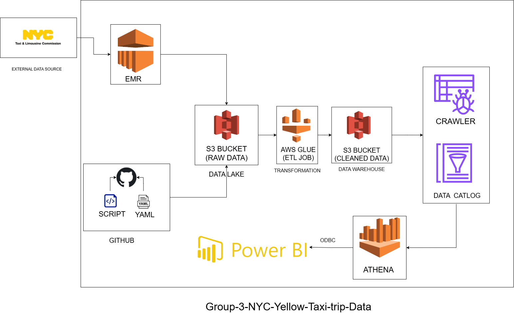

# NYC Yellow Taxi Data ETL & Analytics Dashboard

## 📌 Project Overview
The **NYC Yellow Taxi Data ETL & Analytics Dashboard** project processes over **527 million** taxi trip records from 2016 to 2022.  
It performs data extraction, transformation, and loading (ETL) using **AWS Glue** and **PySpark**, stores the cleaned data in Amazon S3, and visualizes key transportation insights through an **interactive Power BI dashboard**.

The project is designed for **data-driven decision-making** by the **NYC Government** to improve transportation planning, policy-making, and public accessibility of taxi trip data.

---

## 🚀 Features
- **Data Volume**: Handles 527M+ rows of Yellow Taxi trip data
- **Automated ETL Pipeline**: Built with AWS Glue and Terraform for full CI/CD automation
- **Data Storage**: Raw and cleaned data stored in Amazon S3
- **Data Transformation**:
  - Null value filtering
  - Mapping location IDs to zones
  - Feature engineering (Tip %, Distance Bucket)
- **Interactive Dashboard** in Power BI with:
  - Monthly trip trends
  - Passenger count analysis
  - Tip percentage distribution
  - Zone-to-zone trip flow

---

## 🛠️ Tech Stack
**Data Processing**
- AWS Glue (PySpark)
- Amazon S3
- AWS EMR (for exploratory big data processing)

**Automation**
- Terraform
- GitHub Actions (CI/CD)

**Visualization**
- Power BI

---

## 📂 Data Sources
- **NYC TLC Yellow Taxi Trip Data** (2016–2022)
  - Public dataset provided by NYC Taxi & Limousine Commission
  - Stored in a cross-account S3 bucket for processing

---

## 📊 ETL Workflow
1. **Extract**  
   - Read raw Yellow Taxi data from public/cross-account S3 bucket.
   
2. **Transform**  
   - Remove null/invalid values
   - Map PULocationID and DOLocationID to zone names
   - Calculate new fields:
     - `tip_percentage` = `(tip_amount / fare_amount) * 100`
     - `distance_bucket` (0-1 mile / 1-5 mile / 5-10 mile / 10+ mile)
   
3. **Load**  
   - Store cleaned, transformed data into the processed S3 bucket.
   - Automatically update Glue Data Catalog via crawler.

4. **Visualize**  
   - Connect Power BI to processed S3 data (via Athena) for dashboard creation.

---

## ⚙️ Infrastructure Automation
- **Terraform** provisions:
  - Glue jobs
  - Glue crawlers
  - Glue database
  - S3 bucket configurations
- **GitHub Actions** triggers:
  - Upload ETL scripts to S3
  - Deploy Glue pipeline
  - Run ETL jobs automatically

---

